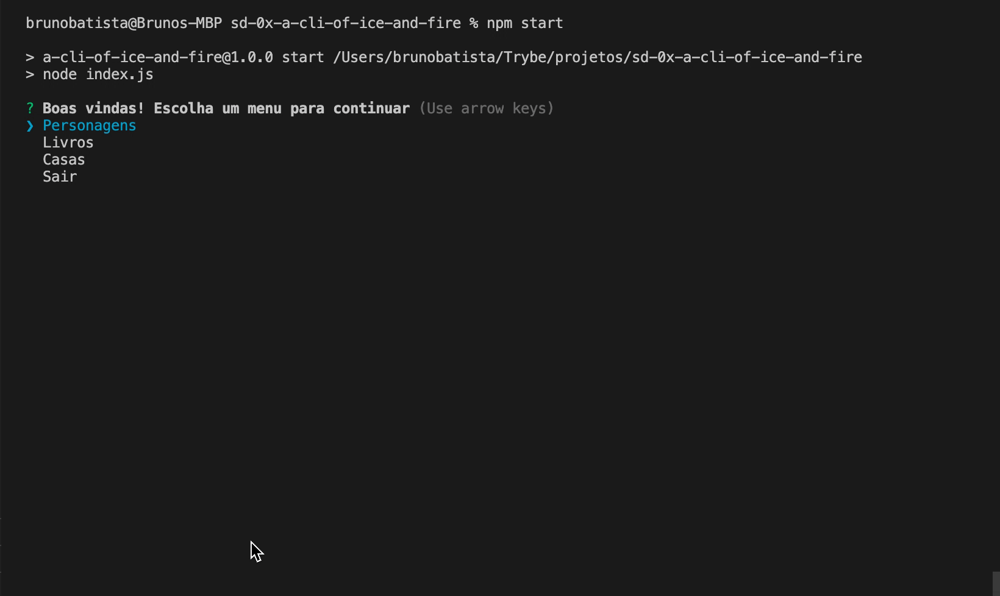
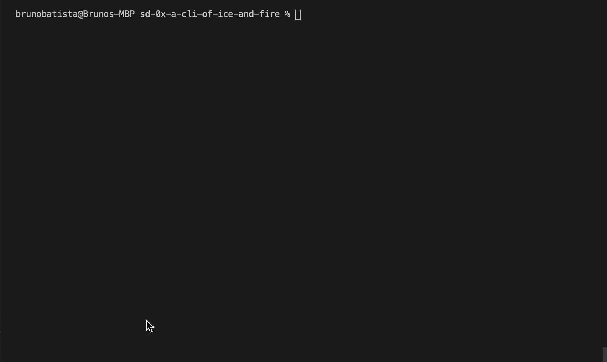
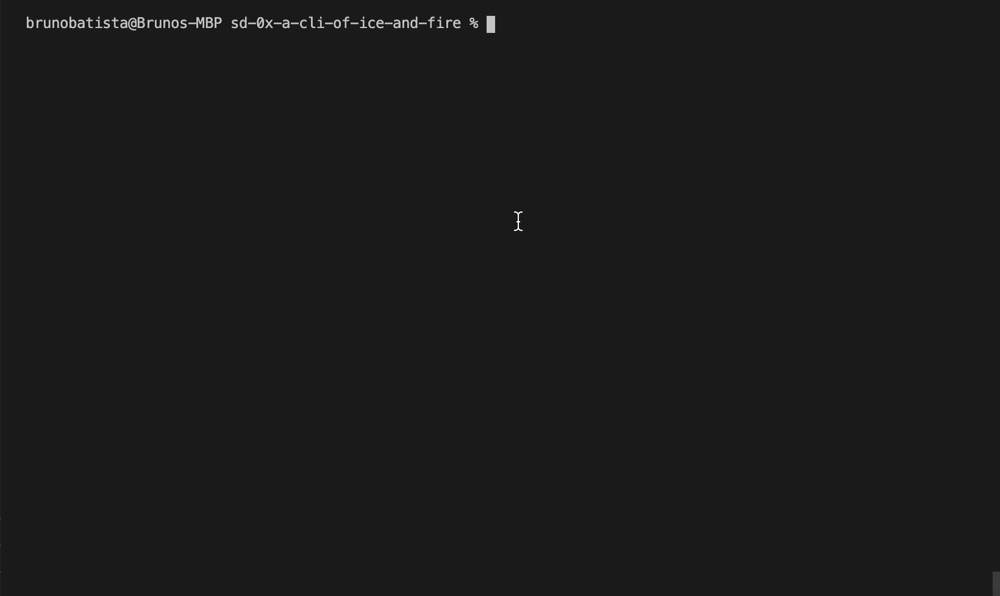
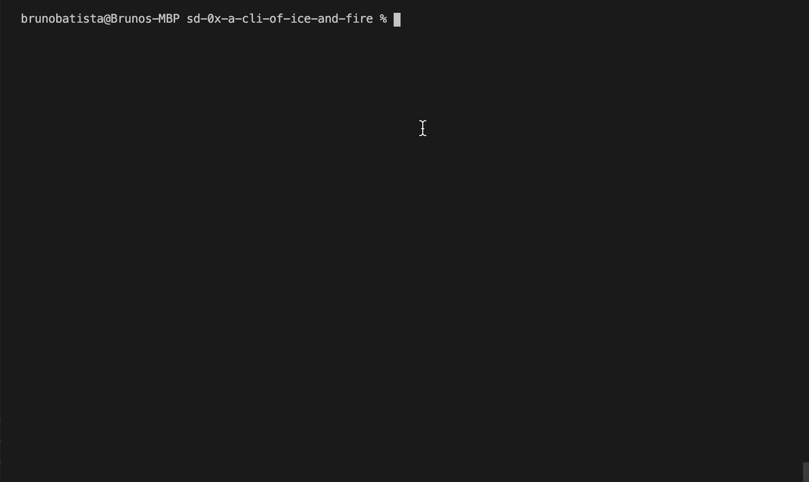

# Boas vindas ao repositório do projeto de A CLI of Ice and Fire!

Você já usa o GitHub diariamente para desenvolver os exercícios, certo? Agora, para desenvolver os projetos, você deverá seguir as instruções a seguir. Fique atento a cada passo, e se tiver qualquer dúvida, nos envie por _Slack_! #vqv 🚀

Aqui você vai encontrar os detalhes de como estruturar o desenvolvimento do seu projeto a partir desse repositório, utilizando uma branch específica e um _Pull Request_ para colocar seus códigos.

---

## Instruções para entregar seu projeto:

### ANTES DE COMEÇAR A DESENVOLVER:

1. Clone o repositório
  * `git clone https://github.com/tryber/sd-0x-a-cli-of-ice-and-fire.git`.
  * Entre na pasta do repositório que você acabou de clonar:
    * `sd-0x-a-cli-of-ice-and-fire`

2. Instale as dependências [**Caso existam**]
  * `npm install`

3. Crie uma branch a partir da branch `master`
  * Verifique que você está na branch `master`
    * Exemplo: `git branch`
  * Se não estiver, mude para a branch `master`
    * Exemplo: `git checkout master`
  * Agora crie uma branch à qual você vai submeter os `commits` do seu projeto
    * Você deve criar uma branch no seguinte formato: `nome-de-usuario-nome-do-projeto`
    * Exemplo: `git checkout -b joaozinho-a-cli-of-ice-and-fire`

4. Adicione as mudanças ao _stage_ do Git e faça um `commit`
  * Verifique que as mudanças ainda não estão no _stage_
    * Exemplo: `git status` (deve aparecer listada a pasta _joaozinho_ em vermelho)
  * Adicione o novo arquivo ao _stage_ do Git
      * Exemplo:
        * `git add .` (adicionando todas as mudanças - _que estavam em vermelho_ - ao stage do Git)
        * `git status` (deve aparecer listado o arquivo _joaozinho/README.md_ em verde)
  * Faça o `commit` inicial
      * Exemplo:
        * `git commit -m 'iniciando o projeto x'` (fazendo o primeiro commit)
        * `git status` (deve aparecer uma mensagem tipo _nothing to commit_ )

5. Adicione a sua branch com o novo `commit` ao repositório remoto
  * Usando o exemplo anterior: `git push -u origin joaozinho-a-cli-of-ice-and-fire`

6. Crie um novo `Pull Request` _(PR)_
  * Vá até a página de _Pull Requests_ do [repositório no GitHub](https://github.com/tryber/sd-0x-blockx-a-cli-of-ice-and-fire/pulls)
  * Clique no botão verde _"New pull request"_
  * Clique na caixa de seleção _"Compare"_ e escolha a sua branch **com atenção**
  * Clique no botão verde _"Create pull request"_
  * Adicione uma descrição para o _Pull Request_ e clique no botão verde _"Create pull request"_
  * **Não se preocupe em preencher mais nada por enquanto!**
  * Volte até a [página de _Pull Requests_ do repositório](https://github.com/tryber/sd-0x-blockx-a-cli-of-ice-and-fire/pulls) e confira que o seu _Pull Request_ está criado

---

# Entregáveis

Para entregar o seu projeto você deverá criar um Pull Request neste repositório. Este Pull Request deverá conter os arquivos `[Arquivos obrigatórios para concluri entrega]`, que conterão seu código `[Exemplo: HTML, CSS e JavaScript]`, respectivamente. Você pode adicionar outros arquivos se julgar necessário. ⚠️ É importante que seus arquivos tenham exatamente estes nomes! ⚠️

Você pode adicionar outros arquivos se julgar necessário. Qualquer dúvida, procure a monitoria. Lembre-se que você pode consultar nosso conteúdo sobre Git & GitHub sempre que quiser!

Você pode adicionar outros arquivos se julgar necessário. Qualquer dúvida, procure a monitoria.

Lembre-se que você pode consultar nosso conteúdo sobre [Git & GitHub](https://course.betrybe.com/intro/git/) sempre que precisar!

---

## O que deverá ser desenvolvido

Você vai refatorar parte de um CLI (command line interface) para que, ao invés de utilizar callbacks, utilize apenas Promises. Além disso, você vai implementar mais algumas funcionalidades, consumindo a mesma API que está sendo consumida.

## Desenvolvimento

O CLI mostra informações sobre o mundo de Game of Thrones utilizando, como fonte dessas informações, uma API pública chamada [An API of Ice And Fire](https://www.anapioficeandfire.com).

O código deste repositório possui a funcionalidade de listar as personagens, e exibir os detalhes sobre uma personagem selecionada. Além de refatorar o código já existente, você deverá adicionar a funcionalidade de buscar livros pelo nome, exibir os resultados, e mostrar os detalhes do livro selecionado.

### Data de Entrega

O projeto tem até a seguinte data: `DD/MM/YYYY - 14:00h`. Para ser entregue a avaliação final.

## Requisitos do projeto

### 💡Veja o exemplo a seguir de como o projeto pode se parecer depois de pronto. Lembre-se que você pode ~~e deve~~ ir além para deixar o projeto com a sua cara e impressionar à todos!


## ⚠️ Leia-os atentamente e siga à risca o que for pedido. ⚠️

O não cumprimento de um requisito, total ou parcialmente, impactará em sua avaliação.

---

### 👀Observações importantes:

Para cada menu novo que você adicionar, crie um diretório dentro de `lib/menus`, e adicione os arquivos do menu lá. Por exemplo, crie um menu `books` e adicione-o ao index da pasta `menus`:

*A estrutura do projeto deve ser a mesma do menu character*

Estrutura do menu Character:
lib/menus/character
lib/menus/character/index.js
lib/menus/character/actions/index.js
lib/menus/character/actions/list.js

Para menus books:

```sh
mkdir lib/menus/books
touch lib/menus/books/index.js
mkdir lib/menus/books/actions
touch lib/menus/books/actions/index.js
touch lib/menus/books/actions/list.js
```

```javascript
module.exports = function () {
  console.log('Menu de livros');
};
```

```javascript
// lib/menus/index.js
const books = require('./books');
const characters = require('./characters');

module.exports = {
  books,
  characters,
};
```

Para menus houses:

```sh
mkdir lib/menus/houses
touch lib/menus/houses/index.js
mkdir lib/menus/houses/actions
touch lib/menus/houses/actions/index.js
touch lib/menus/houses/actions/list.js
```

```javascript
module.exports = function () {
  console.log('Menu de casas');
};
```

```javascript
// lib/menus/index.js
const books = require('./houses');
const characters = require('./characters');

module.exports = {
  houses,
  characters,
};
```

---------------------------------------------------

## Requisitos Obrigatórios:

 O projeto deve ser feito, necessariamente, utilizando Promises.

Não pode haver nenhum tipo de código síncrono ou que utilize callbacks.

Você também pode utilizar async/await sempre que precisar manipular as Promises. Com isso, não existe a necessidade de consumi-las utilizando `then` e `catch`.

> **Dica**: Para entender como utilizar Promises ao invés de callbacks com o superagent, você pode consultar a [documentação oficial no npm](https://www.npmjs.com/package/superagent#node).


### 1 - Exibir, no menu inicial, o sub-menu "livros" e, dentro dele, uma opção "Pesquisar livros"

Ao selecionar essa opção, permita que o usuário insira o nome do livro que deseja pesquisar.

> **Dica**: Você pode seguir a mesma estrutura já existente para o menu de personagens, presente na pasta `lib/menus/characters`.



##### As seguintes verificações serão feitas:

- [**Verifica se a opção livros está no menu inicial**]

- [**Verifica a opção Pesquisar livros está dentro da opção livros**]

### 3 - Utilizando o nome inserido, realizar uma requisição para o endpoint `/books` da API, com o parâmetro `?name` contendo o nome digitado pelo usuário e apresentar os resultados para o usuário numa lista

Você pode consultar [a documentação](https://www.anapioficeandfire.com/Documentation#books) deste endpoint para verificar qual o formato em que os dados serão retornados.

A lista deve exibir apenas o nome do livro, e deve permitir que o usuário escolha um dos livros sobre o qual deseja ver os detalhes.

> **Dica**: Para realizar a busca utilizando o nome informado pelo usuário, você precisa enviar para a API o parâmetro `name` na URL, como o exemplo a seguir: `https://www.anapioficeandfire.com/api/books?name=A Game of Thrones`



##### As seguintes verificações serão feitas:

- [**Verificar se, quando escolho  o livro "A Game of Thrones", ele chama a API e mostra os dados do livro, em seguida mostrando a lista dos outros livros'**]

### 4 - Caso nada seja digitado no momento da pesquisa, exiba todos os livros, paginados de 10 em 10

Quando o CLI solicitar o nome do livro que a pessoa deseja pesquisar, existe a possibilidade de nada ser digitado. Nesse caso, a busca deve ser feita com o parâmetro `?name` em branco (`?name=`), para que a API retorne todos os livros.


##### As seguintes verificações serão feitas:

- [**Digitar nome do livro em branco e ver se a API é chamada passando o parâmetro "nome" em branco**]

- [**Ver se retorna todos os livros paginados**]

### 5 - Apresentar as opções "Próxima página" e "Página anterior" caso existam mais de 10 resultados

Ambas as opções só devem ser exibidas quando de fato forem úteis, ou seja, se o usuário já estiver na primeira página, a opção "Página anterior" não deve ser exibida e, se o usuário já estiver na última página, a opção "Próxima página" não deve ser exibida.

Para entender como a paginação funciona, leia a [documentação da API](https://www.anapioficeandfire.com/Documentation#pagination).

Você precisará ler o conteúdo do header `link`, retornado pela API quando utiliza-se paginação. O arquivo `lib/utils.js` já possui uma função (`parseLinks`) que realiza a leitura desse header e o converte de string para um objeto. O arquivo `lib/menus/characters/actions/list.js` já faz a implementação desse requisito, você pode utiliza-lo como referência.


##### As seguintes verificações serão feitas:

- [**Verificar a presença da opção "Próxima página" na lista de livros**]

- [**Verificar a presença da opção "Página anterior" quando vou para próxima página na lista de livros**]

### 6 - Quando o um livro for selecionado, exibir na tela as propriedades daquele livro

**Atenção:** As propriedades `characters` e `povCharacters` não deverão ser exibidas.

Essa exibição deve ocorrer da mesma forma que ocorre com a personagem no menu "Personagens".

Após exibir os detalhes do livro, a aplicação deve retornar para a tela de resultados de livros.



##### As seguintes verificações serão feitas:

- [**Selecionar livro "A Clash of Kings" e verificar que seus dados apresentados estão corretos**]

### 7 - Sempre exibir uma opção de voltar

Em todos os menus, uma opção de "voltar" deve ser exibida. Essa opção deve levar o usuário para o menu anterior e, através dela, deve ser possível chegar de volta ao menu principal.



##### As seguintes verificações serão feitas:

- [**Verificar a presença da opção "Voltar para o menu principal" no menu de livros**]

- [**Verificar a presença da opção "Voltar para o menu principal" no menu de "Listar livros"**]

- [**Verificar a presença da opção "Voltar para o menu anterior" e "Página anterior" no menu de "Listar livros na página seguinte"**]


### 8 - Caso nenhum resultado for encontrado, exibir uma mensagem e voltar ao menu de livros

A API realiza a busca por palavras exatas no valor informado no parâmetro `name`. Caso seja informado um livro que não existe, a API retornará um Array vazio.

Para esses casos, exiba na tela a mensagem `"Nenhum livro encontrado para essa pesquisa"` e, logo em seguida, retorne ao menu de livros.


##### As seguintes verificações serão feitas:

- [**Enviar um nome de livro que não existe e verificar que a mensagem "Nenhum livro encontrado para essa pesquisa" é exibida na tela posteriormente**]

### 9 - Exibir opção de listar as casas do mundo de Game of Thrones

Exibir, no menu principal, um menu "casas" e, dentro dele, uma opção "Listar casas".

O comportamento deve ser idêntico ao de listar personagens, inclusive a paginação, que deve atender ao [requisito 5](#5---apresentar-as-opções-"próxima-página"-e-"página-anterior"-caso-existam-mais-de-10-resultados).

**Atenção** A propriedade `swornMembers` não deve ser exibida ao selecionar uma casa.


##### As seguintes verificações serão feitas:

- [**Verificar se existe a opcao "casas" no menu inicial**]

- [**Ao selecionar casas verificar se existe a opcao "listar casas"**]

- [**Verificar a opcao "Próxima página"**]

- [**Verificar a opcao "Página anterior" quando vou para proxima pagina**]


## Requisitos Bônus:

### 10 - Implemente testes unitários que cubram 90% do código

Cobrir 90% dos testes unitários do projeto, utilizando os frameworks [`jest`](https://jestjs.io/docs/en/getting-started.html) e [`inquirer`](https://github.com/SBoudrias/Inquirer.js#documentation).

##### As seguintes verificações serão feitas:

- [**Iremos usar o jest para rodar o coverage do projeto para ver se cobriu 90% dos testes unitarios**]

---
### DURANTE O DESENVOLVIMENTO

* Faça `commits` das alterações que você fizer no código regularmente

* Lembre-se de sempre após um (ou alguns) `commits` atualizar o repositório remoto

* Os comandos que você utilizará com mais frequência são:
  1. `git status` _(para verificar o que está em vermelho - fora do stage - e o que está em verde - no stage)_
  2. `git add` _(para adicionar arquivos ao stage do Git)_
  3. `git commit` _(para criar um commit com os arquivos que estão no stage do Git)_
  4. `git push -u nome-da-branch` _(para enviar o commit para o repositório remoto na primeira vez que fizer o `push` de uma nova branch)_
  5. `git push` _(para enviar o commit para o repositório remoto após o passo anterior)_

---

### DEPOIS DE TERMINAR O DESENVOLVIMENTO (OPCIONAL)

Para sinalizar que o seu projeto está pronto para o _"Code Review"_ dos seus colegas, faça o seguinte:

* Vá até a página **DO SEU** _Pull Request_, adicione a label de _"code-review"_ e marque seus colegas:

  * No menu à direita, clique no _link_ **"Labels"** e escolha a _label_ **code-review**;

  * No menu à direita, clique no _link_ **"Assignees"** e escolha **o seu usuário**;

  * No menu à direita, clique no _link_ **"Reviewers"** e digite `students`, selecione o time `tryber/students-sd-0x`.

Caso tenha alguma dúvida, [aqui tem um video explicativo](https://vimeo.com/362189205).

---

### REVISANDO UM PULL REQUEST

Use o conteúdo sobre [Code Review](https://course.betrybe.com/real-life-engineer/code-review/) para te ajudar a revisar os _Pull Requests_.

#VQV